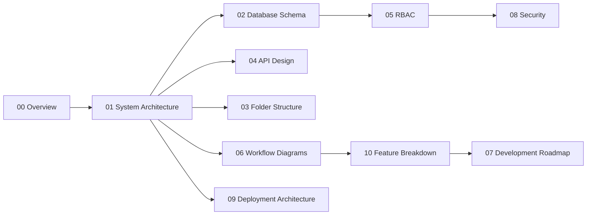

# 00 — Overview & Index

## 1. Vision

TravelOS AI is a **multi-tenant, AI-native SaaS CRM** purpose-built for tour & travel operators (Travel
Agencies, DMCs, Tour Operators). It replaces the typical patchwork of spreadsheets, WhatsApp, generic
CRMs, and manual ops sheets with a single system that runs the business end-to-end — from the moment a
lead arrives to the moment a traveller returns home and leaves feedback.

The platform is designed to be **production-grade from day one**: secure, observable, horizontally
scalable, and white-label / multi-tenant ready, while keeping a pragmatic delivery path via a modular
monolith that can be progressively decomposed into services.

## 2. Design Principles

| Principle | What it means in practice |
|-----------|---------------------------|
| **Multi-tenant by default** | Every business-domain row carries `tenant_id`. PostgreSQL Row-Level Security (RLS) enforces isolation at the database layer, not just the app layer. |
| **Modular monolith first** | One deployable NestJS app composed of strongly-bounded modules. Each module owns its schema, services, and API surface so it can be extracted into a microservice later without rewrites. |
| **Provider abstraction** | AI (OpenAI/Gemini), messaging (WhatsApp), telephony (Exotel/Knowlarity), payments (Razorpay/Cashfree), and storage (S3-compatible) all sit behind interfaces. Swapping a vendor is a config + adapter change, not a refactor. |
| **Event-driven side effects** | Long-running and cross-module work (AI summaries, email automation, voucher PDF generation, webhook fan-out) runs on Redis-backed BullMQ queues — never inline in the request path. |
| **Async-first integrations** | All third-party calls are retried, idempotent, and observable. Inbound webhooks are verified, persisted raw, then processed. |
| **Security & auditability are not optional** | RBAC, audit trail, encryption-at-rest for secrets/PII, session & login history, and IP tracking are foundational modules, built in Phase 0–1. |
| **API-first** | Every capability is exposed through a versioned REST API. The Next.js frontend and the customer portal are just clients; future mobile apps and B2B partners reuse the same contracts. |
| **Future-ready, not future-built** | We design seams (multi-tenancy, AI agent hooks, channel abstraction, i18n keys) for AI calling agents, voice bots, multilingual, B2B/DMC, flight/hotel APIs — without building them prematurely. |

## 3. The Business Lifecycle (One-Liner Map)

```
CAPTURE   →  Omnichannel leads land, deduped, auto-assigned (round-robin / team / destination)
MANAGE    →  Lead moves through stages with timeline, tasks, reminders, calls, chats, emails
ENRICH    →  AI reads conversations → extracts requirements, scores hot leads, predicts conversion
QUOTE     →  Multiple versioned quotations + itinerary builder sync, tracked to acceptance
CONFIRM   →  Won lead transfers to Operations
OPERATE   →  Hotel & transport procurement → vouchers → final itinerary → customer delivery
COLLECT   →  Advance/partial/final payments via Razorpay/Cashfree, invoices & receipts
SERVE     →  Customer portal (OTP login): quotations, itinerary, invoices, vouchers, status
ANALYZE   →  Dashboards + AI insights: why leads/quotes are lost, top destinations, team performance
```

## 4. The 20 Modules at a Glance

| # | Module | Phase |
|---|--------|-------|
| 1 | Lead Capture Engine | 1 |
| 2 | Lead Management CRM | 1 |
| 3 | AI Assistant | 2 |
| 4 | Call Management (Exotel/Knowlarity) | 3 |
| 5 | WhatsApp Business Integration | 2 |
| 6 | Quotation Management | 2 |
| 7 | Itinerary Builder Integration | 2 |
| 8 | Operations Management | 3 |
| 9 | Hotel / Vendor Management | 3 |
| 10 | Transport Management | 3 |
| 11 | Payment Management | 4 |
| 12 | Customer Portal | 4 |
| 13 | Voucher Management (PDF) | 3 |
| 14 | Email Automation | 2 |
| 15 | Reports & Analytics | 5 |
| 16 | AI Analytics | 5 |
| 17 | Role-Based Access Control | 0 |
| 18 | Security | 0 |
| 19 | Audit Trail | 0 |
| 20 | Future-Ready Features | Cross-cutting |

See [10 — Feature Breakdown](10-feature-breakdown.md) for full decomposition and [07 — Roadmap](07-development-roadmap.md) for sequencing.

## 5. Glossary

| Term | Definition |
|------|------------|
| **Tenant / Organization** | A travel business account on the platform. Top-level isolation boundary. |
| **Lead** | A potential customer/enquiry, captured from any source. |
| **Booking / Trip** | A confirmed lead that has entered the Operations pipeline. |
| **Quotation** | A versioned priced proposal sent to a lead; a lead can have many. |
| **Itinerary** | The day-by-day travel plan, imported/synced from the external itinerary builder. |
| **Vendor** | A hotel or transport supplier in the vendor database. |
| **Voucher** | A confirmation document (customer/hotel/transport/vendor), generated as PDF. |
| **Channel** | A communication medium: WhatsApp, Email, Call, Portal. |
| **RBAC** | Role-Based Access Control — see [05](05-user-roles-rbac.md). |
| **RLS** | PostgreSQL Row-Level Security — tenant isolation at the DB. |
| **DMC** | Destination Management Company (a future B2B partner type). |

## 6. How to Read These Documents



Start at **01** for the big picture, then **02** for the data model — together they anchor everything else.
