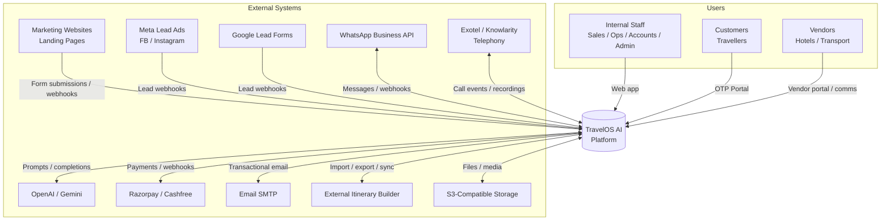
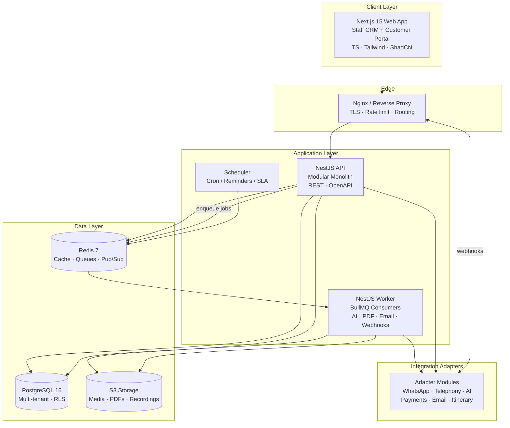
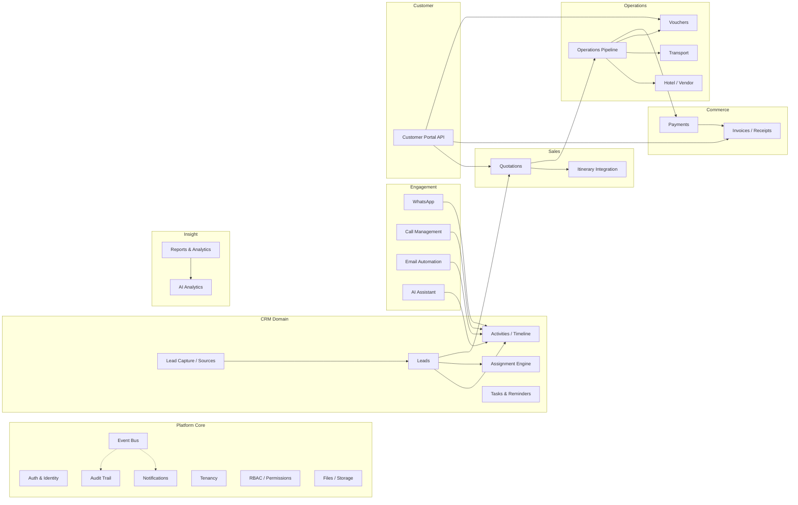
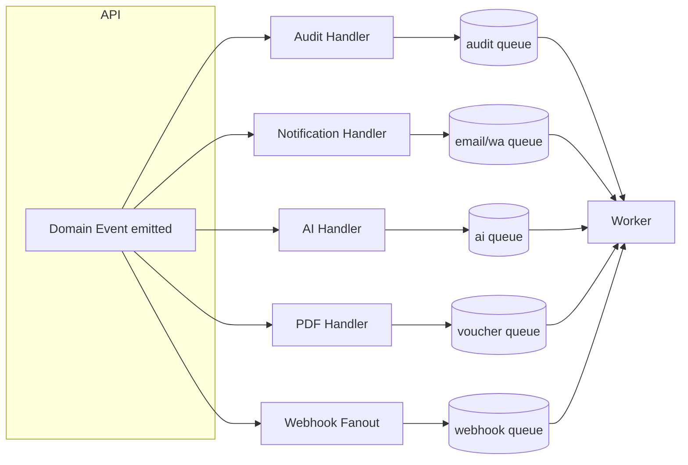

# 01 — System Architecture

## 1. Architectural Style

TravelOS AI is a **modular monolith** backend (NestJS) fronted by a **Next.js 15** application, backed by
**PostgreSQL** and **Redis**, with all heavy/async work pushed to **BullMQ queues**. Third-party systems
(AI, WhatsApp, telephony, payments, storage) are integrated through **adapter modules** behind stable
interfaces. The design lets us ship fast as one deployable while keeping clean seams to extract services
(AI, Messaging, Operations) when scale demands it.

### Why modular monolith (not microservices on day one)

- A travel CRM's modules are **highly transactional and cross-referential** (a lead touches quotations,
  payments, ops, comms). Distributed transactions early = accidental complexity.
- One codebase + one deploy = faster iteration for Phases 0–4.
- Strong module boundaries + an internal event bus mean the **path to services is mechanical**, not a rewrite.

## 2. C4 — Level 1: System Context



## 3. C4 — Level 2: Container Diagram



### Containers

| Container | Responsibility | Scale unit |
|-----------|----------------|-----------|
| **Next.js Web App** | Staff CRM UI + Customer Portal (route-segmented). SSR/ISR for dashboards, RSC for data fetching. | Stateless, horizontal |
| **Nginx / Reverse Proxy** | TLS termination, routing (`/api`, `/`, `/webhooks`), basic rate limiting, gzip. | Edge |
| **NestJS API** | Synchronous request handling, authZ, validation, transactional writes, read APIs. | Stateless, horizontal |
| **NestJS Worker** | BullMQ consumers: AI summarization, PDF/voucher generation, email send, webhook processing, message ingestion. | Stateless, horizontal (per-queue concurrency) |
| **Scheduler** | Cron-driven jobs: reminders, follow-up SLAs, quotation expiry, travel reminders, report rollups. | Singleton (leader-elected) |
| **PostgreSQL** | System of record, multi-tenant with RLS. | Primary + read replicas |
| **Redis** | Cache, BullMQ queues, rate-limit counters, OTP store, pub/sub for realtime. | Cluster/replica |
| **S3 Storage** | Media (WhatsApp/voice), call recordings, generated PDFs, attachments. | Managed |

## 4. Backend Module Map (inside the NestJS monolith)



Every module depends on **Platform Core** (auth, tenancy, RBAC, audit, events). Domain modules
communicate **synchronously** via injected services within a request, and **asynchronously** via the
in-process event bus → BullMQ for side effects (see §6).

## 5. Request Lifecycle (synchronous path)

```mermaid
sequenceDiagram
    participant C as Client (Next.js)
    participant N as Nginx
    participant G as NestJS Guards
    participant H as Controller/Service
    participant DB as PostgreSQL (RLS)
    participant Q as Redis/BullMQ

    C->>N: HTTPS request (+ JWT)
    N->>G: Forward /api
    G->>G: AuthGuard (verify JWT)
    G->>G: TenantGuard (resolve tenant_id)
    G->>G: RbacGuard (check permission)
    G->>G: ValidationPipe (DTO)
    G->>H: Authorized request
    H->>DB: SET app.tenant_id; query/tx (RLS enforced)
    DB-->>H: Rows (tenant-scoped)
    H->>Q: Enqueue side-effects (audit, email, AI)
    H-->>C: 2xx + JSON (typed contract)
```

## 6. Eventing & Async Processing

The platform uses a two-tier event model:

1. **In-process domain events** (NestJS `EventEmitter`) — emitted within a transaction's success path
   (`lead.created`, `quotation.accepted`, `payment.captured`, `ops.stage.advanced`).
2. **Durable jobs** (BullMQ on Redis) — event handlers enqueue jobs for anything that is slow, retryable,
   or must survive a crash.



**Queue catalogue (initial):** `audit`, `email`, `whatsapp.out`, `whatsapp.in`, `ai.summarize`,
`ai.extract`, `ai.score`, `voucher.pdf`, `invoice.pdf`, `call.transcribe`, `report.rollup`,
`reminder.dispatch`, `webhook.process`, `integration.retry`. Each has tuned concurrency, retry/backoff,
and a dead-letter queue.

## 7. Realtime

For live CRM updates (new lead landed, chat message arrived, payment confirmed) the API publishes to a
Redis pub/sub channel; a lightweight WebSocket/SSE gateway (NestJS Gateway) pushes tenant-scoped events
to connected staff clients. Customer portal uses polling/SSE for status changes only.

## 8. Multi-Tenancy Model

- **Strategy:** Shared database, shared schema, **`tenant_id` on every business table + PostgreSQL RLS**.
- **Why:** Best operational simplicity and cost at SMB→mid-market scale; strong isolation via RLS;
  trivially supports white-label since tenancy is a first-class column.
- **Enforcement:** Each request sets `SET LOCAL app.current_tenant = :tenant_id` inside its transaction;
  RLS policies restrict every row to the active tenant. Application code also scopes via a base repository,
  giving **defense in depth** (app + DB).
- **Tenant resolution:** From the authenticated user's `tenant_id` claim (staff) or the OTP-issued
  portal token (customers). Custom domains / white-label map host → tenant at the edge.
- **Escape hatch:** Platform `super_admin` operations run with RLS bypass via a dedicated, audited role.

See [02 — Database Schema](02-database-schema.md) §Multi-tenancy and [08 — Security](08-security-architecture.md).

## 9. Integration Architecture (Adapters)

```mermaid
graph TB
    subgraph Core
        SVC[Domain Services]
    end
    subgraph Ports (Interfaces)
        IAI[AIProvider]
        IMSG[MessagingProvider]
        ITEL[TelephonyProvider]
        IPAY[PaymentProvider]
        IMAIL[EmailProvider]
        ISTO[StorageProvider]
        IITN[ItineraryProvider]
    end
    SVC --> IAI & IMSG & ITEL & IPAY & IMAIL & ISTO & IITN

    IAI --> OAI[OpenAIAdapter] & GEM[GeminiAdapter]
    IMSG --> WAB[WhatsAppCloudAdapter]
    ITEL --> EXO[ExotelAdapter] & KNO[KnowlarityAdapter]
    IPAY --> RZP[RazorpayAdapter] & CFR[CashfreeAdapter]
    IMAIL --> SMT[SmtpAdapter] & SES[SES/Resend Adapter]
    ISTO --> S3A[S3Adapter] & MIN[MinIOAdapter]
    IITN --> ITBA[ItineraryBuilderAdapter]
```

**Inbound webhooks** (WhatsApp, Meta/Google lead ads, telephony, payments, itinerary) hit a dedicated
`/webhooks/:provider` controller that: (1) verifies signature, (2) persists the raw payload to an
`integration_events` table, (3) returns `200` immediately, (4) enqueues processing. This makes ingestion
idempotent, replayable, and resilient.

## 10. Frontend Architecture

- **Next.js 15 App Router** with route groups: `(staff)` for the CRM, `(portal)` for customers, `(auth)`.
- **React Server Components** for data-heavy pages; client components for interactive widgets (Kanban,
  chat timeline, builders).
- **ShadCN UI + Tailwind** as the design system; a shared `ui` package for primitives.
- **Data access** via a generated, type-safe API client (OpenAPI → TS types) — no hand-drift between FE/BE.
- **Auth** via httpOnly refresh cookie + in-memory access token; middleware guards route groups.
- **State**: server state via TanStack Query; minimal global client state via Zustand.

## 11. Technology Decision Records (summary)

| Decision | Choice | Rationale |
|----------|--------|-----------|
| Backend shape | Modular monolith | Speed now, service-extractable later |
| ORM | Prisma (primary) | Type-safe, great DX, migrations; RLS via session var |
| Tenancy | Shared schema + RLS | Cost/ops simplicity + strong isolation |
| Queue | BullMQ on Redis | Mature, observable, already need Redis |
| API protocol | REST + OpenAPI | Broad client support, portal/mobile/B2B reuse |
| Realtime | SSE/WebSocket via Redis pub/sub | Simple, tenant-scoped fan-out |
| PDF | Headless Chromium (Puppeteer) templates | Pixel-accurate vouchers/invoices |
| AI | Provider interface (OpenAI + Gemini) | Cost/quality routing, no lock-in |

> Full ADRs will be maintained under `docs/adr/` once implementation starts.

## 12. Non-Functional Targets (initial)

| Attribute | Target |
|-----------|--------|
| Availability | 99.9% (single-region, multi-AZ) |
| API p95 latency | < 300 ms (read), < 600 ms (write) |
| Async SLA | AI summary < 60 s, voucher PDF < 30 s, email < 30 s |
| Tenant isolation | Enforced at DB (RLS) + app layer |
| RPO / RTO | RPO ≤ 5 min (WAL/PITR), RTO ≤ 1 h |
| Scale (v1) | 1k tenants, 10k staff users, 5M leads, 50M activities |
