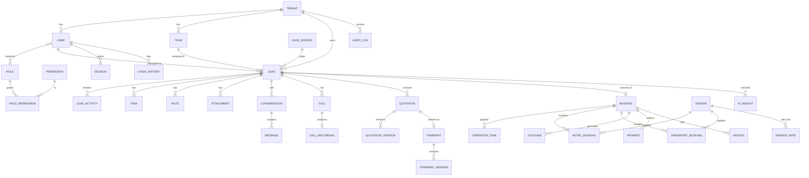

# 02 — Database Schema & ER Diagram

PostgreSQL 16. Multi-tenant (shared schema + Row-Level Security). All identifiers are `UUID v7`
(time-ordered) primary keys. All business tables carry `tenant_id`, `created_at`, `updated_at`, and
(where relevant) soft-delete `deleted_at`. Money is stored as `NUMERIC(14,2)` with an explicit `currency`
column; never floats.

---

## 1. High-Level ER Diagram (core domains)



> The diagram is intentionally domain-level. Full column-level tables follow. Junction/lookup tables
> (e.g. `role_permission`, `lead_tag`) are listed in their sections.

---

## 2. Conventions

| Concern | Convention |
|---------|------------|
| PK | `id UUID DEFAULT uuid_generate_v7() PRIMARY KEY` |
| Tenant scope | `tenant_id UUID NOT NULL REFERENCES tenant(id)` + RLS policy |
| Timestamps | `created_at`, `updated_at TIMESTAMPTZ NOT NULL DEFAULT now()` |
| Soft delete | `deleted_at TIMESTAMPTZ NULL` (partial indexes `WHERE deleted_at IS NULL`) |
| Enums | Postgres `ENUM` types for stable domains; lookup tables where tenant-extensible |
| Money | `amount NUMERIC(14,2)`, `currency CHAR(3)` (default `INR`) |
| JSON | `JSONB` for flexible payloads (AI extractions, raw webhooks, metadata) |
| Audit | created/updated by `user_id` on mutable business rows |
| Naming | `snake_case` tables/columns, singular table names |

---

## 3. Platform Core

### `tenant`
| Column | Type | Notes |
|--------|------|-------|
| id | UUID PK | |
| name | TEXT | Business name |
| slug | TEXT UNIQUE | URL/subdomain |
| custom_domain | TEXT NULL | White-label host |
| status | ENUM(`active`,`trial`,`suspended`,`cancelled`) | |
| plan | ENUM(`starter`,`growth`,`enterprise`) | |
| settings | JSONB | Branding, locale, feature flags |
| billing_email | TEXT | |
| created_at / updated_at | TIMESTAMPTZ | |

### `user`
| Column | Type | Notes |
|--------|------|-------|
| id | UUID PK | |
| tenant_id | UUID FK | |
| email | CITEXT | Unique per tenant |
| phone | TEXT | E.164 |
| password_hash | TEXT NULL | Argon2id; null for OTP-only |
| full_name | TEXT | |
| avatar_url | TEXT NULL | |
| status | ENUM(`active`,`invited`,`disabled`) | |
| is_2fa_enabled | BOOLEAN | |
| totp_secret_enc | BYTEA NULL | Encrypted |
| last_login_at | TIMESTAMPTZ NULL | |
| created_at / updated_at / deleted_at | | |

Unique: `(tenant_id, email)`, `(tenant_id, phone)`.

### `team`
`id, tenant_id, name, type(ENUM sales|operations|accounts|vendor), manager_user_id, created_at`.

### `team_member`
Junction: `team_id, user_id, role_in_team`. PK `(team_id, user_id)`.

### `role`
`id, tenant_id NULL (NULL = system role), key, name, description, is_system BOOLEAN`. See [05 — RBAC](05-user-roles-rbac.md).

### `permission`
`id, key (e.g. lead.create), resource, action, description`. Global catalogue.

### `role_permission`
Junction: `role_id, permission_id`. PK `(role_id, permission_id)`.

### `user_role`
Junction: `user_id, role_id, scope_team_id NULL`. Allows team-scoped roles.

---

## 4. Lead Capture & Management (Modules 1–2)

### `lead_source`
| Column | Type | Notes |
|--------|------|-------|
| id | UUID PK | |
| tenant_id | UUID FK | |
| type | ENUM(`website`,`landing_page`,`contact_form`,`manual`,`whatsapp`,`facebook_ads`,`instagram_ads`,`google_forms`,`referral`,`import`) | |
| name | TEXT | e.g. "Goa Landing Page" |
| config | JSONB | webhook secret, form id, ad account id |
| is_active | BOOLEAN | |

### `lead`
| Column | Type | Notes |
|--------|------|-------|
| id | UUID PK | |
| tenant_id | UUID FK | |
| source_id | UUID FK → lead_source | |
| reference_code | TEXT | Human ID, e.g. `LD-2026-000123` |
| stage | ENUM(`new`,`contacted`,`interested`,`quotation_sent`,`negotiation`,`follow_up`,`confirmed`,`lost`,`cancelled`) | |
| status | ENUM(`open`,`won`,`lost`) | derived rollup |
| name | TEXT | |
| email | CITEXT NULL | |
| phone | TEXT | E.164, key for dedupe |
| alt_phone | TEXT NULL | |
| destination | TEXT NULL | |
| travel_date | DATE NULL | |
| return_date | DATE NULL | |
| adults | INT | |
| children | INT | |
| budget_amount | NUMERIC(14,2) NULL | |
| budget_currency | CHAR(3) | |
| hotel_preference | TEXT NULL | |
| flight_required | BOOLEAN NULL | |
| special_requests | TEXT NULL | |
| assigned_user_id | UUID FK NULL | |
| assigned_team_id | UUID FK NULL | |
| priority | ENUM(`low`,`medium`,`high`,`hot`) | AI may set |
| score | INT NULL | 0–100 conversion score (AI) |
| lost_reason_id | UUID FK NULL → lost_reason | |
| dedupe_hash | TEXT | normalized phone/email hash |
| metadata | JSONB | raw capture payload |
| created_by | UUID FK NULL | |
| created_at / updated_at / deleted_at | | |

Indexes: `(tenant_id, stage)`, `(tenant_id, assigned_user_id)`, `(tenant_id, phone)`,
`(tenant_id, dedupe_hash)`, `(tenant_id, destination)`, `(tenant_id, travel_date)`, GIN on `metadata`.

### `lead_dedupe_match`
Records detected duplicates: `id, tenant_id, lead_id, duplicate_of_lead_id, match_type(phone|email|fuzzy), confidence, resolved BOOLEAN, resolved_by`.

### `assignment_rule`
| Column | Type | Notes |
|--------|------|-------|
| id, tenant_id | | |
| name | TEXT | |
| strategy | ENUM(`round_robin`,`team`,`destination`,`load_balanced`,`manual`) | |
| conditions | JSONB | source/destination/budget matchers |
| target_team_id | UUID NULL | |
| target_user_ids | UUID[] NULL | round-robin pool |
| priority | INT | rule order |
| is_active | BOOLEAN | |

`assignment_rule_state` keeps round-robin cursors: `rule_id, last_user_id`.

### `lead_activity` (timeline)
| Column | Type | Notes |
|--------|------|-------|
| id, tenant_id, lead_id | | |
| type | ENUM(`stage_change`,`note`,`task`,`call`,`whatsapp`,`email`,`quotation`,`payment`,`assignment`,`ai_insight`,`system`) | |
| title | TEXT | |
| body | TEXT NULL | |
| ref_table | TEXT NULL | polymorphic link |
| ref_id | UUID NULL | |
| actor_user_id | UUID NULL | |
| metadata | JSONB | |
| created_at | | |

Index: `(tenant_id, lead_id, created_at DESC)`.

### `note`
`id, tenant_id, lead_id, author_user_id, body, is_pinned, created_at`.

### `task`
| Column | Type | Notes |
|--------|------|-------|
| id, tenant_id, lead_id NULL | | tasks can be standalone |
| title, description | | |
| type | ENUM(`call`,`follow_up`,`email`,`whatsapp`,`meeting`,`custom`) | |
| due_at | TIMESTAMPTZ | |
| remind_at | TIMESTAMPTZ NULL | drives reminder queue |
| status | ENUM(`pending`,`in_progress`,`done`,`cancelled`) | |
| assignee_user_id | UUID FK | |
| completed_at | TIMESTAMPTZ NULL | |

Index: `(tenant_id, assignee_user_id, due_at)`, `(tenant_id, remind_at) WHERE status='pending'`.

### `tag` & `lead_tag`
`tag(id, tenant_id, name, color)`; `lead_tag(lead_id, tag_id)` PK both.

### `lost_reason`
`id, tenant_id, label, category` — tenant-configurable (feeds AI loss analytics).

---

## 5. Communications (Modules 4–5, 14)

### `conversation`
| Column | Type | Notes |
|--------|------|-------|
| id, tenant_id, lead_id NULL | | |
| channel | ENUM(`whatsapp`,`email`,`sms`) | |
| external_id | TEXT | WA thread / email thread id |
| contact_handle | TEXT | phone / email |
| last_message_at | TIMESTAMPTZ | |
| unread_count | INT | |
| status | ENUM(`open`,`closed`,`archived`) | |

Unique: `(tenant_id, channel, external_id)`.

### `message`
| Column | Type | Notes |
|--------|------|-------|
| id, tenant_id, conversation_id | | |
| direction | ENUM(`inbound`,`outbound`) | |
| sender | TEXT | |
| body | TEXT NULL | |
| content_type | ENUM(`text`,`image`,`audio`,`video`,`document`,`location`,`template`) | |
| media_file_id | UUID FK NULL → file | |
| transcription | TEXT NULL | voice-note → text (AI) |
| status | ENUM(`queued`,`sent`,`delivered`,`read`,`failed`) | |
| external_id | TEXT | provider message id |
| template_key | TEXT NULL | WA template used |
| created_at | | |

Index: `(tenant_id, conversation_id, created_at)`.

### `call`
| Column | Type | Notes |
|--------|------|-------|
| id, tenant_id, lead_id NULL | | |
| provider | ENUM(`exotel`,`knowlarity`,`manual`) | |
| direction | ENUM(`inbound`,`outbound`) | |
| from_number / to_number | TEXT | |
| agent_user_id | UUID FK NULL | |
| status | ENUM(`ringing`,`answered`,`missed`,`busy`,`failed`,`completed`) | |
| started_at / ended_at | TIMESTAMPTZ | |
| duration_sec | INT | |
| recording_file_id | UUID FK NULL → file | |
| transcription | TEXT NULL | AI |
| summary | TEXT NULL | AI |
| external_call_id | TEXT | |
| notes | TEXT NULL | |

### `email_template` & `email_log`
`email_template(id, tenant_id, key, name, subject, html_body, variables JSONB, is_active)`.
`email_log(id, tenant_id, lead_id NULL, template_key, to_email, subject, status(queued|sent|failed|bounced|opened), provider_message_id, error, sent_at)`.

### `automation` (email/comm automation rules)
`id, tenant_id, trigger_event(quotation_sent|payment_received|invoice_generated|voucher_generated|travel_reminder|feedback_request), channel, template_key, delay_minutes, conditions JSONB, is_active`.

---

## 6. Quotations & Itinerary (Modules 6–7)

### `quotation`
| Column | Type | Notes |
|--------|------|-------|
| id, tenant_id, lead_id | | |
| reference_code | TEXT | `QT-2026-000045` |
| title | TEXT | |
| current_version_id | UUID FK NULL → quotation_version | |
| revision_count | INT | |
| status | ENUM(`draft`,`sent`,`viewed`,`accepted`,`rejected`,`expired`) | |
| sent_at | TIMESTAMPTZ NULL | |
| viewed_at | TIMESTAMPTZ NULL | |
| decided_at | TIMESTAMPTZ NULL | |
| valid_until | DATE NULL | drives expiry job |
| rejection_reason | TEXT NULL | |
| total_amount | NUMERIC(14,2) | |
| currency | CHAR(3) | |
| created_by | UUID FK | |

Index: `(tenant_id, lead_id)`, `(tenant_id, status)`, `(tenant_id, valid_until) WHERE status IN ('sent','viewed')`.

### `quotation_version`
| Column | Type | Notes |
|--------|------|-------|
| id, tenant_id, quotation_id | | |
| version_no | INT | |
| line_items | JSONB | itemized pricing |
| subtotal / tax / discount / total | NUMERIC(14,2) | |
| currency | CHAR(3) | |
| itinerary_version_id | UUID FK NULL | snapshot link |
| pdf_file_id | UUID FK NULL | |
| notes | TEXT | |
| created_by | UUID | |
| created_at | | |

Unique: `(quotation_id, version_no)`.

### `itinerary`
`id, tenant_id, lead_id NULL, quotation_id NULL, external_id, title, destination, duration_days, current_version_id, source(ENUM imported|built), created_at`.

### `itinerary_version`
| Column | Type | Notes |
|--------|------|-------|
| id, tenant_id, itinerary_id | | |
| version_no | INT | |
| payload | JSONB | day-wise plan (canonical normalized form) |
| external_version_ref | TEXT NULL | builder's version id |
| pdf_file_id | UUID NULL | |
| synced_at | TIMESTAMPTZ | |

### `integration_event` (raw inbound from itinerary builder & all webhooks)
`id, tenant_id NULL, provider, event_type, signature_valid BOOLEAN, payload JSONB, status(received|processed|failed), processed_at, error, created_at`.

---

## 7. Operations, Vendors, Vouchers (Modules 8–10, 13)

### `booking`
The confirmed-lead operational record.
| Column | Type | Notes |
|--------|------|-------|
| id, tenant_id, lead_id | | one booking per won lead |
| reference_code | TEXT | `BK-2026-000077` |
| quotation_id | UUID FK | accepted quotation |
| destination | TEXT | |
| travel_start / travel_end | DATE | |
| pax_adults / pax_children | INT | |
| total_value | NUMERIC(14,2) | |
| currency | CHAR(3) | |
| ops_stage | ENUM(`confirmed`,`hotel_procurement`,`transport_procurement`,`voucher_generation`,`final_itinerary`,`delivered`,`completed`,`cancelled`) | |
| ops_owner_user_id | UUID FK NULL | operations executive |
| handover_at | TIMESTAMPTZ | sales→ops timestamp |
| created_at / updated_at | | |

### `operation_task`
Pipeline checklist items: `id, tenant_id, booking_id, stage, title, status(pending|in_progress|blocked|done), assignee_user_id, due_at, completed_at, notes`.

### `vendor`
| Column | Type | Notes |
|--------|------|-------|
| id, tenant_id | | |
| type | ENUM(`hotel`,`transport`,`activity`,`other`) | |
| name | TEXT | |
| destination | TEXT | |
| contact_person | TEXT | |
| phone / email | TEXT | |
| address | TEXT | |
| status | ENUM(`active`,`inactive`,`blacklisted`) | |
| rating | NUMERIC(2,1) NULL | |
| metadata | JSONB | |

### `vendor_rate`
`id, tenant_id, vendor_id, label, room_type/vehicle_type, contract_rate NUMERIC, negotiated_rate NUMERIC, currency, valid_from, valid_to, season, notes`.

### `hotel_booking`
| Column | Type | Notes |
|--------|------|-------|
| id, tenant_id, booking_id, vendor_id | | |
| hotel_name | TEXT | denormalized snapshot |
| room_type | TEXT | |
| check_in / check_out | DATE | |
| rooms / nights | INT | |
| rate / total | NUMERIC(14,2) | |
| status | ENUM(`requested`,`quoted`,`confirmed`,`cancelled`) | |
| confirmation_no | TEXT NULL | |
| voucher_id | UUID FK NULL | |

### `transport_booking`
| Column | Type | Notes |
|--------|------|-------|
| id, tenant_id, booking_id, vendor_id | | |
| vehicle_type | ENUM(`taxi`,`tempo_traveller`,`coach`,`other`) | |
| driver_name / driver_phone | TEXT NULL | |
| pickup / drop | TEXT | |
| service_date | DATE | |
| rate / total | NUMERIC(14,2) | |
| status | ENUM(`requested`,`confirmed`,`cancelled`) | |
| voucher_id | UUID FK NULL | |

### `vendor_communication`
`id, tenant_id, vendor_id, booking_id NULL, channel(email|whatsapp|call), direction, subject, body, ref_external_id, created_by, created_at` — rate requests & vendor threads.

### `voucher`
| Column | Type | Notes |
|--------|------|-------|
| id, tenant_id, booking_id | | |
| type | ENUM(`customer`,`hotel`,`transport`,`vendor`) | |
| reference_code | TEXT | |
| status | ENUM(`draft`,`generated`,`sent`,`void`) | |
| pdf_file_id | UUID FK NULL | |
| issued_to | TEXT | customer/vendor name |
| payload | JSONB | rendered data snapshot |
| generated_at | TIMESTAMPTZ NULL | |
| created_by | UUID | |

---

## 8. Payments & Invoicing (Module 11)

### `invoice`
| Column | Type | Notes |
|--------|------|-------|
| id, tenant_id, booking_id | | |
| invoice_no | TEXT | sequential per tenant |
| status | ENUM(`draft`,`issued`,`partially_paid`,`paid`,`cancelled`,`refunded`) | |
| subtotal / tax / discount / total | NUMERIC(14,2) | |
| amount_paid | NUMERIC(14,2) | |
| currency | CHAR(3) | |
| due_date | DATE NULL | |
| line_items | JSONB | |
| pdf_file_id | UUID FK NULL | |
| issued_at | TIMESTAMPTZ NULL | |

### `payment`
| Column | Type | Notes |
|--------|------|-------|
| id, tenant_id, booking_id, invoice_id NULL | | |
| type | ENUM(`advance`,`partial`,`final`) | |
| amount | NUMERIC(14,2) | |
| currency | CHAR(3) | |
| status | ENUM(`pending`,`partial`,`paid`,`refunded`,`cancelled`,`failed`) | |
| gateway | ENUM(`razorpay`,`cashfree`,`manual`,`bank_transfer`,`cash`) | |
| gateway_order_id | TEXT NULL | |
| gateway_payment_id | TEXT NULL | |
| method | TEXT NULL | upi/card/netbanking |
| paid_at | TIMESTAMPTZ NULL | |
| receipt_file_id | UUID FK NULL | |
| metadata | JSONB | gateway raw |

Index: `(tenant_id, booking_id)`, `(tenant_id, status)`, unique `(gateway, gateway_payment_id)`.

### `payment_webhook` (gateway callbacks)
`id, tenant_id NULL, gateway, event_type, signature_valid, payload JSONB, payment_id NULL, status, created_at`.

---

## 9. Customer Portal (Module 12)

The customer is a `lead`/`booking` contact; portal access is via OTP, not a staff `user`.

### `portal_identity`
| Column | Type | Notes |
|--------|------|-------|
| id, tenant_id | | |
| lead_id | UUID FK NULL | |
| phone | TEXT | login handle |
| email | CITEXT NULL | |
| last_login_at | TIMESTAMPTZ | |
| is_active | BOOLEAN | |

### `otp_challenge`
`id, tenant_id, identity_ref (phone/email), channel(sms|whatsapp|email), code_hash, purpose(login|verify), expires_at, consumed_at, attempts, created_at`. (Codes hashed, short TTL, rate-limited.)

### `portal_access_grant`
Controls what a customer can see/download: `id, tenant_id, portal_identity_id, resource_type(quotation|itinerary|invoice|voucher|payment), resource_id, can_view, can_download`.

---

## 10. AI Layer (Modules 3, 16)

### `ai_insight`
| Column | Type | Notes |
|--------|------|-------|
| id, tenant_id, lead_id NULL, booking_id NULL | | |
| kind | ENUM(`lead_summary`,`call_summary`,`chat_summary`,`requirement_extract`,`conversion_score`,`hot_lead`,`loss_reason`,`quote_rejection`,`mgmt_insight`) | |
| model | TEXT | provider/model used |
| input_ref | JSONB | source message/call ids |
| output | JSONB | structured result |
| confidence | NUMERIC(4,3) NULL | |
| created_at | | |

### `ai_extracted_requirement` (denormalized for filtering/reporting)
`id, tenant_id, lead_id, destination, travel_date, budget, adults, children, hotel_preference, flight_required, special_requests, source_insight_id, created_at`.

### `ai_job` (traceability/cost)
`id, tenant_id, kind, provider, prompt_tokens, completion_tokens, cost_usd, latency_ms, status, error, created_at`.

---

## 11. Security, Audit & Files (Modules 18–19)

### `audit_log`
| Column | Type | Notes |
|--------|------|-------|
| id, tenant_id | | |
| actor_user_id | UUID NULL | null for system/customer |
| actor_type | ENUM(`user`,`customer`,`system`,`integration`) | |
| action | ENUM(`created`,`updated`,`deleted`,`assigned`,`transferred`,`status_changed`,`payment_updated`,`quotation_updated`,`login`,`logout`,`export`,`permission_change`) | |
| resource_type | TEXT | e.g. `lead`, `payment` |
| resource_id | UUID NULL | |
| before | JSONB NULL | |
| after | JSONB NULL | |
| ip_address | INET NULL | |
| user_agent | TEXT NULL | |
| created_at | TIMESTAMPTZ | |

Append-only (no UPDATE/DELETE grant). Partitioned monthly by `created_at`. Index `(tenant_id, resource_type, resource_id, created_at DESC)`.

### `session`
`id, tenant_id, user_id, refresh_token_hash, ip_address, user_agent, device, expires_at, revoked_at, created_at, last_seen_at`.

### `login_history`
`id, tenant_id, user_id NULL, email, success BOOLEAN, failure_reason, ip_address, user_agent, created_at`.

### `file`
| Column | Type | Notes |
|--------|------|-------|
| id, tenant_id | | |
| bucket / object_key | TEXT | S3 location |
| filename | TEXT | |
| content_type | TEXT | |
| size_bytes | BIGINT | |
| checksum | TEXT | |
| category | ENUM(`attachment`,`media`,`recording`,`voucher`,`invoice`,`receipt`,`itinerary`,`avatar`) | |
| owner_resource_type | TEXT NULL | |
| owner_resource_id | UUID NULL | |
| is_public | BOOLEAN | portal downloads via signed URLs only |
| created_by | UUID NULL | |
| created_at | | |

### `attachment`
Lightweight join for lead docs: `id, tenant_id, lead_id, file_id, label, uploaded_by`.

### `notification`
`id, tenant_id, user_id, type, title, body, ref_table, ref_id, is_read, created_at` — in-app bell.

### `webhook_endpoint` & `webhook_delivery` (outbound, for B2B/future)
`webhook_endpoint(id, tenant_id, url, secret, events TEXT[], is_active)`;
`webhook_delivery(id, tenant_id, endpoint_id, event, payload, status, attempts, last_error, next_retry_at)`.

---

## 12. Reporting

Operational queries run on read replicas. Heavy analytics use **materialized views** refreshed by the
`report.rollup` job:

- `mv_lead_funnel` — counts per stage per tenant per period.
- `mv_source_performance` — leads/conversions/revenue by source.
- `mv_revenue_by_destination`, `mv_revenue_by_month`.
- `mv_employee_performance` — leads handled, conversion %, revenue, avg response time.
- `mv_vendor_summary` — bookings/spend per vendor.

A future option (Phase 5+) is a star-schema reporting schema (`fact_booking`, `fact_payment`,
`dim_date`, `dim_destination`, `dim_user`, `dim_source`) if analytics volume warrants it.

---

## 13. Multi-Tenancy & RLS

Every business table includes `tenant_id`. RLS is enabled and a policy restricts rows to the session
tenant:

```sql
ALTER TABLE lead ENABLE ROW LEVEL SECURITY;

CREATE POLICY tenant_isolation ON lead
  USING (tenant_id = current_setting('app.current_tenant')::uuid)
  WITH CHECK (tenant_id = current_setting('app.current_tenant')::uuid);
```

- The app sets `SET LOCAL app.current_tenant = :id` at the start of every transaction.
- A migration generator applies the identical policy to all tenant-scoped tables (kept in sync via a
  shared SQL helper).
- The application DB role has **no BYPASSRLS**. A separate, tightly-scoped `platform_admin` role (used
  only by audited super-admin tooling) may bypass.
- Cross-tenant foreign keys are forbidden by convention and checked in CI.

## 14. Indexing & Performance Notes

- Hot lists (lead board, conversations, tasks) get composite indexes leading with `tenant_id` + the
  primary filter + a sort key.
- `GIN` indexes on `metadata`/`payload` JSONB where filtered.
- Time-series-heavy tables (`audit_log`, `message`, `lead_activity`, `ai_job`) are **partitioned by
  month** with automated partition management.
- `pg_trgm` for fuzzy lead dedupe (name/phone similarity).
- Foreign keys indexed; partial indexes exclude soft-deleted rows.

## 15. Migrations & Seed

- **Prisma Migrate** for schema; a post-migrate SQL step applies RLS policies, partitions, and ENUMs not
  expressible in Prisma.
- Seed data: system roles & permission catalogue, default lead stages/lost reasons, email templates,
  and a demo tenant **for local/dev only** (never in production seed).
