# 06 — Workflow Diagrams

End-to-end and per-module workflows. All diagrams are Mermaid (render on GitHub).

---

## 1. Master Lifecycle (Lead → Traveller)

```mermaid
flowchart TD
    A[Lead Captured<br/>omnichannel] --> B{Duplicate?}
    B -- yes --> B1[Link / Merge<br/>dedupe]
    B -- no --> C[Auto-create Lead]
    B1 --> C
    C --> D[Auto-Assign<br/>round-robin / team / destination]
    D --> E[Lead Management<br/>stages + timeline]
    E --> F[AI Enrichment<br/>summarize · extract · score]
    F --> G[Quotation(s)<br/>versioned, sent]
    G --> H{Customer Decision}
    H -- Rejected --> H1[Capture rejection reason] --> E
    H -- Accepted --> I[Sales Confirmed<br/>create Booking]
    I --> J[Handover to Operations]
    J --> K[Hotel Procurement]
    K --> L[Transport Procurement]
    L --> M[Voucher Generation]
    M --> N[Final Itinerary]
    N --> O[Customer Delivery<br/>portal + email]
    O --> P[Payments Collected<br/>advance → final]
    P --> Q[Travel Reminder]
    Q --> R[Feedback Request]
    R --> S[Analytics & AI Insights]
```

## 2. Lead Capture & Deduplication

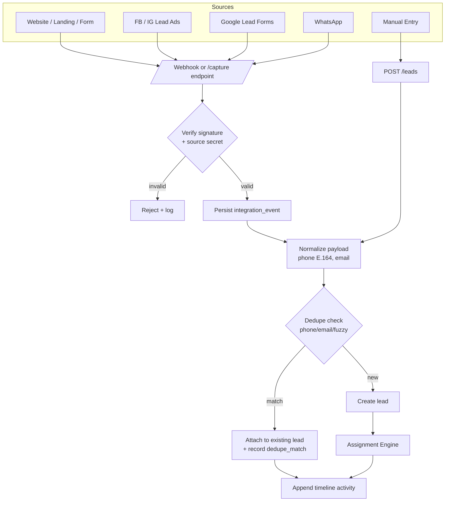

### Assignment Engine

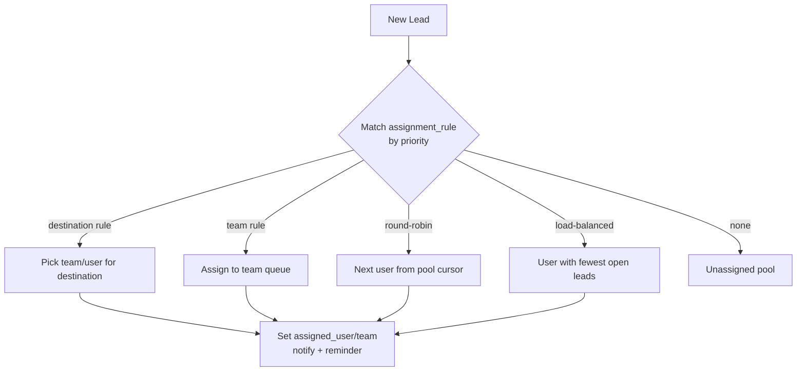

## 3. Lead Stage Machine

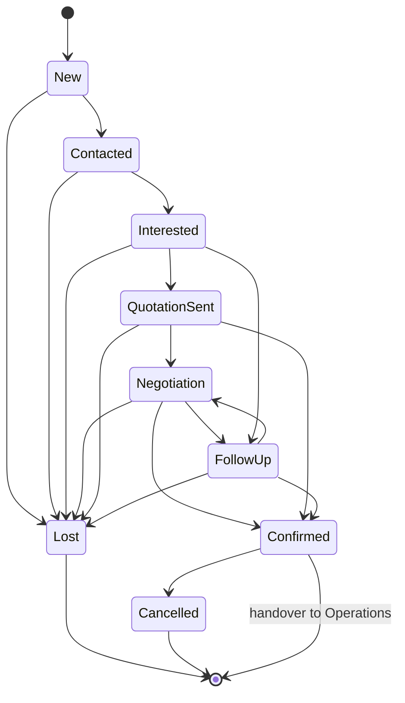
Transitions to `Lost`/`Cancelled` require a reason (feeds AI loss analytics). `Confirmed` triggers
booking creation + ops handover.

## 4. AI Assistant Pipeline

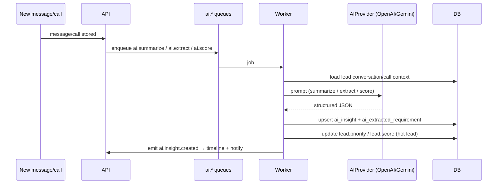
Extraction targets: **destination, travel date, budget, adults, children, hotel preference, flight
requirement, special requests**. Scoring outputs a 0–100 conversion probability and a hot-lead flag.

## 5. WhatsApp Sync

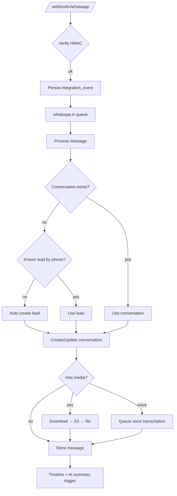
Outbound: template messages via `whatsapp.out` queue with delivery-status callbacks updating `message.status`.

## 6. Call Management

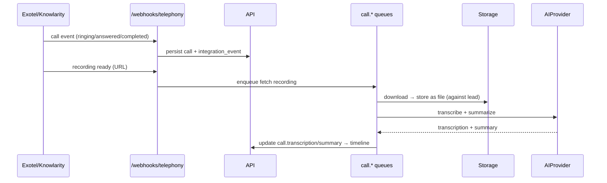

## 7. Quotation Lifecycle

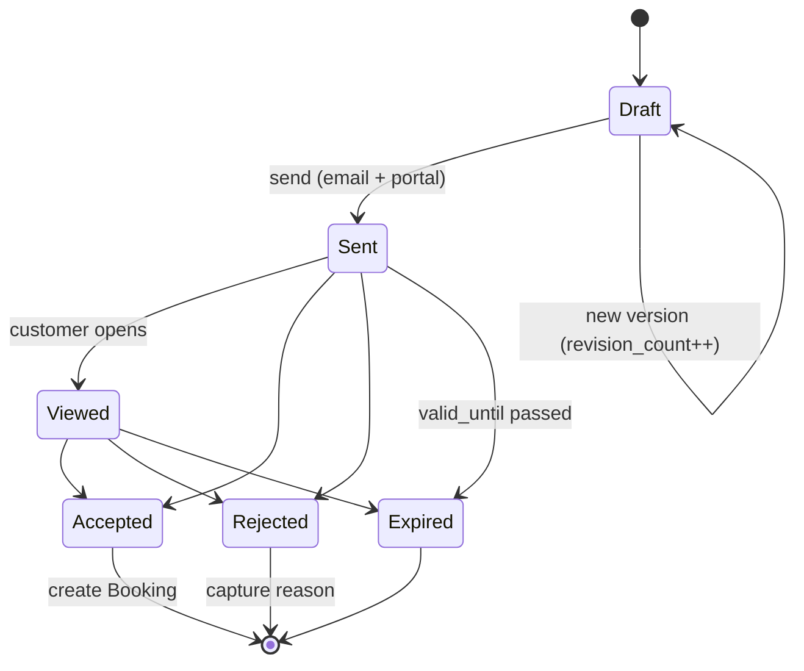
Each lead may hold multiple quotations; each quotation holds multiple versions (revisions). Accept
triggers booking + ops handover; reject/expire feeds AI rejection analytics.

## 8. Itinerary Integration

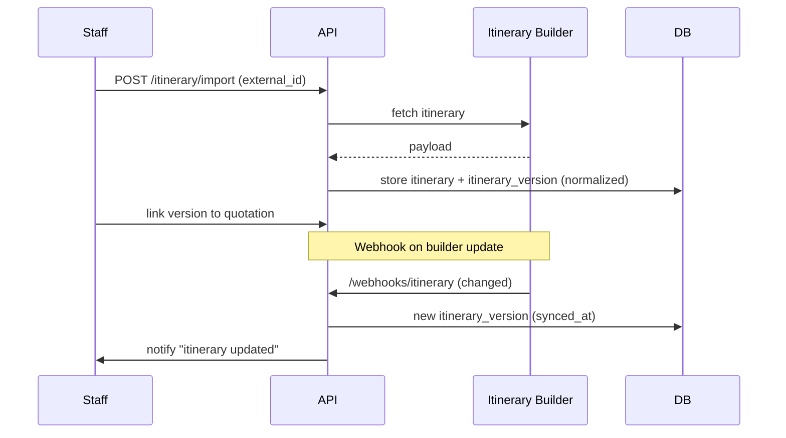

## 9. Operations Pipeline

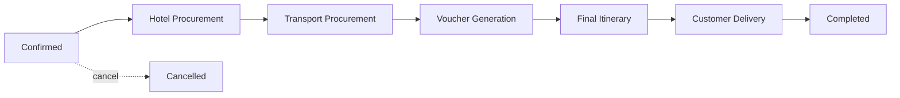
Each stage spawns `operation_task` checklist items assigned to ops executives; stage advances only when
its required tasks are `done`. Every action is timeline-logged and audited.

### Vendor Procurement (per hotel/transport)

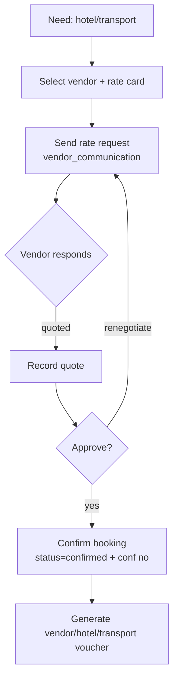

## 10. Payment Flow

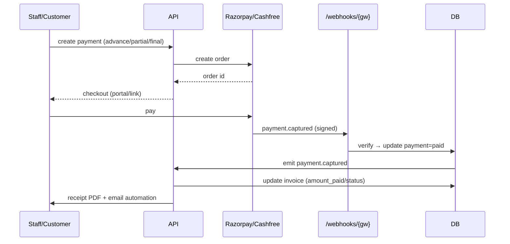
Statuses: `pending → partial → paid`, plus `refunded` / `cancelled` / `failed`. Manual/cash/bank
payments are recorded directly (no gateway), still generating receipts.

## 11. Voucher & PDF Generation

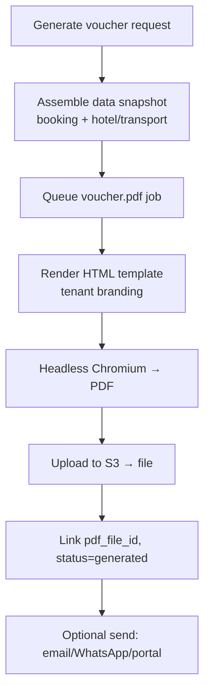
Same pipeline produces customer vouchers, hotel/transport/vendor vouchers, invoices, and receipts.

## 12. Email Automation

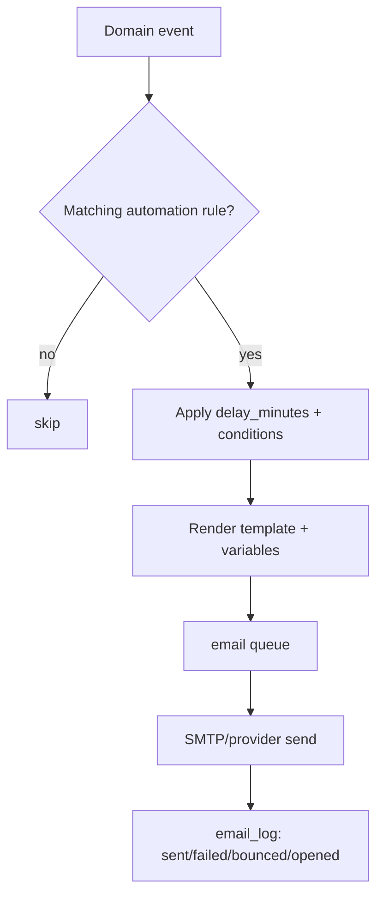
Triggers: quotation sent, payment received, invoice generated, voucher generated, travel reminder,
feedback request.

## 13. Customer Portal (OTP)

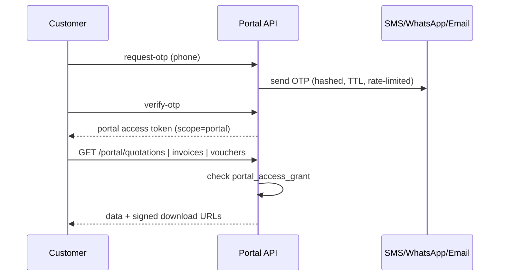

## 14. Audit Trail (cross-cutting)

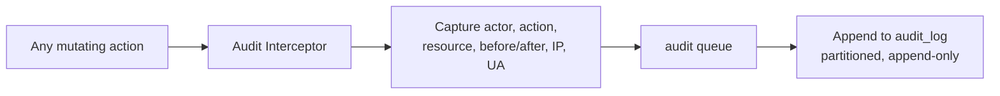
Captured actions: created, updated, deleted, assigned, transferred, status/payment/quotation updated,
login/logout, export, permission change.
