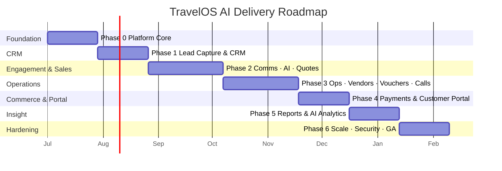

# 07 — Development Roadmap & Sprint Plan

Phased delivery. Each phase ships a **usable, deployable** increment. Sprints are 2 weeks. Estimates
assume a small senior team (≈2 backend, 2 frontend, 1 full-stack/devops, shared design). Adjust to team
size — the **sequence and dependencies** are the durable part.

> **Approval gate:** Phase 0 begins only after this architecture is approved.

---

## Phase Overview

---

## Phase 0 — Foundation (Sprints 1–2)
**Goal:** secure, multi-tenant skeleton that everything else builds on.

- Monorepo (Turborepo/pnpm), CI/CD, Docker dev stack (Postgres, Redis, MinIO).
- Prisma schema baseline + **RLS** policies + migration tooling.
- **Auth** (JWT access/refresh, OTP, 2FA-ready), session & login history.
- **Tenancy** (tenant context, RLS session var, host→tenant resolution).
- **RBAC** (roles, permissions catalogue, guards, `@Can`) — Module 17.
- **Audit trail** interceptor + append-only log — Module 19.
- **Security** baseline (helmet, rate limiting, secrets, encryption helpers) — Module 18.
- Core infra: event bus, BullMQ, storage provider, config validation, notifications.
- App shell (Next.js): auth flows, layout, RBAC-gated nav, design system.

**Exit criteria:** A user can be invited, log in (password/OTP), and every action is tenant-isolated and audited.

## Phase 1 — Lead Capture & CRM (Sprints 3–4) · Modules 1–2
- Lead sources + public `/capture` endpoints + Meta/Google/website webhooks.
- Dedupe + merge; assignment engine (round-robin/team/destination/load-balanced).
- Lead CRUD, stage machine, Kanban + list, lead detail.
- Timeline, notes, tasks, reminders (scheduler), attachments.

**Exit criteria:** Leads flow in from ≥2 real sources, dedupe, auto-assign, and progress through stages with a working timeline.

## Phase 2 — Engagement, AI & Sales (Sprints 5–7) · Modules 3, 5, 6, 7, 14
- **WhatsApp** integration (sync, media→S3, conversation inbox, templates).
- **AI Assistant**: summarize chats, extract requirements, conversion scoring, hot-lead flags (provider abstraction OpenAI+Gemini).
- **Quotations**: multi-quote, versioning, send/accept/reject, expiry, PDF.
- **Itinerary** integration (import/sync/link, versions).
- **Email automation** (templates + rule engine + first triggers).

**Exit criteria:** A lead can be enriched by AI, receive multiple versioned quotations over WhatsApp/email, and accept one.

## Phase 3 — Operations, Vendors, Vouchers, Calls (Sprints 8–10) · Modules 4, 8, 9, 10, 13
- Booking creation on quotation accept + **sales→ops handover**.
- Operations pipeline + operation tasks per stage.
- **Vendor** database, rate cards, vendor communications.
- **Hotel** & **Transport** procurement and bookings.
- **Voucher** + PDF generation pipeline (customer/hotel/transport/vendor).
- **Call management** (Exotel/Knowlarity): logs, recordings→S3, AI transcription/summary.

**Exit criteria:** A confirmed booking can be fully operated — hotels/transport procured, vouchers generated, calls logged & transcribed.

## Phase 4 — Payments & Customer Portal (Sprints 11–12) · Modules 11, 12
- **Payments**: Razorpay/Cashfree, orders, webhooks, advance/partial/final, refunds.
- **Invoices & receipts** (PDF), payment reports.
- **Customer Portal**: OTP login, view quotations/itinerary/invoices/payments/vouchers, signed downloads, mobile-responsive.

**Exit criteria:** A customer can log in via OTP, view their trip, and pay; payments reconcile to invoices automatically.

## Phase 5 — Reports & AI Analytics (Sprints 13–14) · Modules 15, 16
- Dashboards: lead, sales, operations, revenue, destination, vendor.
- Reports: source performance, conversion, revenue analysis, employee performance, destination revenue.
- Materialized views + rollup jobs.
- **AI Analytics**: why leads/quotes are lost, top destinations, team performance, common requirements, auto management insights.

**Exit criteria:** Management can see live dashboards and receive AI-generated insights with drill-downs.

## Phase 6 — Scale, Security Hardening & GA (Sprints 15–16) · Module 18+, 20 seams
- Load/performance testing, read replicas, partitioning verification, caching tuning.
- Security review/pentest, 2FA enforcement policies, data-retention & export (DSR).
- Observability hardening (tracing, alerting, runbooks), backup/restore drills (PITR).
- White-label theming polish; finalize seams for future-ready features (AI calling agents, voice bots, i18n, B2B/DMC, flight/hotel APIs, mobile, outbound webhooks).

**Exit criteria:** Production-ready GA: meets NFR targets, passes security review, documented runbooks, DR tested.

---

## Cross-Cutting (every phase)
- Tests (unit + e2e) gated in CI; coverage thresholds on core/domain modules.
- OpenAPI kept current → regenerate typed client.
- ADRs recorded for significant decisions (`docs/adr/`).
- Audit + RBAC checks added with each new resource.
- Accessibility & mobile-responsiveness for all customer-facing surfaces.

## Definition of Done (per feature)
1. Code + tests merged via PR review.
2. DTO validation + RBAC permission + audit logging in place.
3. Tenant isolation verified (RLS + row scope).
4. OpenAPI updated; client regenerated; UI wired.
5. Observability: logs/metrics/traces emitted.
6. Docs/runbook updated where operationally relevant.

## Risk Register (top items)
| Risk | Mitigation |
|------|-----------|
| Third-party API instability (WA/telephony/payments) | Adapter isolation, retries/backoff, raw-payload persistence, replay. |
| AI cost/latency/quality | Provider routing, caching, token budgeting, async-only, confidence gating. |
| Multi-tenant data leakage | RLS + app row-scope (defense in depth), CI checks, audit. |
| Scope creep from Module 20 | Build seams, not features, until post-GA. |
| PDF rendering performance | Dedicated queue + Chromium pool + templating cache. |
