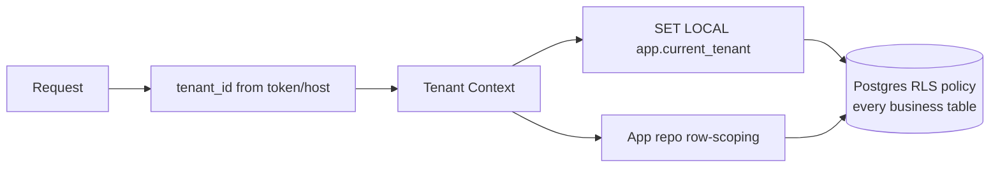

# 08 — Security Architecture

Security is a Phase 0 foundation, not an afterthought. This covers identity, authorization, tenant
isolation, data protection, auditing, and operational security. (Modules 17–19.)

---

## 1. Threat Model (summary)

| Asset | Threats | Primary controls |
|-------|---------|------------------|
| Customer PII & travel data | Leakage, cross-tenant access | RLS + app row-scope, encryption, least privilege |
| Payments | Fraud, tampering, replay | Gateway webhooks signature-verified, idempotency, audit |
| Credentials / tokens | Theft, brute force, replay | Argon2id, short-lived JWT, refresh rotation, rate limits, 2FA |
| Integrations (WA/telephony) | Spoofed webhooks | HMAC/signature verification, IP allowlists, raw persistence |
| Admin actions | Privilege abuse | RBAC, separation of duties, full audit trail |
| Files (recordings/vouchers) | Unauthorized download | Private buckets, signed URLs, access grants |

## 2. Authentication

- **Passwords:** Argon2id hashing; strength policy; never logged.
- **JWT access tokens:** ~15 min TTL; claims `{ sub, tenant_id, roles, scope }`; signed (RS256, rotating keys).
- **Refresh tokens:** opaque, httpOnly + Secure + SameSite cookie; **rotated on every use**; stored hashed
  in `session`; reuse detection revokes the session family.
- **OTP login:** codes hashed at rest, short TTL, max attempts, per-identity + per-IP rate limits;
  delivered via SMS/WhatsApp/email.
- **2FA-ready (TOTP):** optional per user, enforceable per role (Admin/Accounts/Super Admin); secret
  stored encrypted.
- **Session management:** active sessions listable & revocable; device/IP/UA recorded; idle + absolute
  expiry; logout revokes refresh.
- **Login history:** every attempt (success/failure, reason, IP, UA) recorded.

## 3. Authorization

- **RBAC** with granular `resource.action` permissions; deny-overrides; team-scoped role assignments
  (see [05](05-user-roles-rbac.md)).
- **Guards pipeline:** Auth → Tenant → Permission → row-scope (`read_own`/team) in services.
- **Scope separation:** staff tokens (`scope: staff`) and portal tokens (`scope: portal`) cannot cross
  surfaces.
- **Cross-tenant access returns 404**, never 403, to avoid resource-existence leakage.
- **Least privilege** DB roles: app role has no `BYPASSRLS`; a separate audited `platform_admin` role
  for super-admin tooling only.

## 4. Multi-Tenant Isolation (defense in depth)

- **Layer 1 (DB):** RLS policy `tenant_id = current_setting('app.current_tenant')` on all business tables.
- **Layer 2 (App):** base repository injects `tenant_id` into every query/write.
- **CI guards:** tests assert RLS is enabled on new tables; lint forbids cross-tenant FKs.

## 5. Data Protection

- **In transit:** TLS 1.2+ everywhere (edge, internal where applicable); HSTS.
- **At rest:** disk/volume encryption for DB & object storage; column-level encryption for secrets
  (TOTP, integration credentials, API keys) using a KMS-managed key + envelope encryption.
- **PII handling:** access via RBAC only; recordings/transcripts treated as sensitive; configurable
  retention; export & deletion (DSR) tooling in Phase 6.
- **Files:** private S3 buckets; access only via time-limited **signed URLs**; portal downloads gated by
  `portal_access_grant`.
- **Secrets:** never in code; injected via environment/secret manager; `.env` validated at boot; rotation supported.
- **Idempotency:** `Idempotency-Key` on money/message POSTs; gateway webhooks de-duped by event id.

## 6. Application Security Controls

- **Input validation:** all DTOs validated; unknown fields rejected; output DTOs prevent over-fetch.
- **Injection:** parameterized queries via Prisma; no raw string SQL with user input.
- **AuthN/Z on every route** (no implicit-public except verified webhooks & signed capture endpoints).
- **Rate limiting & throttling:** Redis token buckets per IP + per tenant; strict on auth/OTP/portal/capture.
- **CORS:** allowlist of tenant origins (incl. white-label custom domains).
- **Headers:** Helmet (CSP, X-Frame-Options, X-Content-Type-Options, Referrer-Policy).
- **CSRF:** SameSite cookies + token pattern for cookie-authed flows.
- **Bot/abuse protection** on public capture endpoints (per-source secret, optional captcha/honeypot).
- **Dependency security:** automated SCA (Dependabot/audit) in CI; pinned versions; image scanning.
- **No direct DB exposure:** database is private-network only; all access via the API.

## 7. Webhook & Integration Security

- Signature/HMAC verification per provider (WhatsApp, Meta, Razorpay, Cashfree, telephony, itinerary).
- Raw payloads persisted (`integration_event` / `payment_webhook`) before processing → replay & audit.
- Optional source IP allowlists; reject + log invalid signatures.
- Outbound webhooks (B2B) signed with per-endpoint secret; retried with backoff.

## 8. Audit Trail (Module 19)

- **Append-only** `audit_log` (no UPDATE/DELETE grant to app role); monthly partitioned.
- Captures: actor (user/customer/system/integration), action, resource, before/after, IP, UA, timestamp.
- Tracked actions include create/update/delete/assign/transfer/status/payment/quotation changes,
  login/logout, export, permission change.
- Audit writes are async (queue) but guaranteed via an outbox pattern so a crash can't silently drop them.
- Tamper-evidence option (hash-chaining) reserved for enterprise tier.

## 9. Logging, Monitoring & IP/Session Tracking

- **Structured logs** with `requestId`, tenant, user, route, status, latency (PII-redacted).
- **IP tracking** on auth, sessions, and sensitive actions; anomalous-login alerting (new geo/device).
- **Metrics & traces** (OpenTelemetry) for latency, error rates, queue depth, integration health.
- **Alerting** on auth anomalies, webhook signature failures, queue backlog, error spikes.

## 10. Compliance & Governance Posture

- Principles aligned to **OWASP ASVS / Top 10** and **India DPDP** + **GDPR** readiness
  (data minimization, consent records on capture, right to access/erasure, retention policy).
- **PCI scope minimized:** card data never touches our servers — handled by Razorpay/Cashfree
  hosted/checkout; we store only gateway references.
- Role-based data export with audit; configurable data retention per tenant.

## 11. Operational Security

- Secrets in a managed secret store; least-privilege cloud IAM.
- Separate environments (dev/staging/prod) with isolated data and credentials.
- Backups encrypted; **restore drills** scheduled; PITR via WAL (RPO ≤ 5 min).
- Incident response runbook; severity levels; breach-notification process.
- Principle of least privilege for human DB/infra access; just-in-time admin access, fully audited.

## 12. Security Checklist (enforced in CI / review)
- [ ] New table has `tenant_id` + RLS policy + index.
- [ ] New endpoint has Auth + `@Can` permission + audit + DTO validation.
- [ ] No secret in code/logs; sensitive columns encrypted.
- [ ] Webhooks verify signatures and persist raw payload.
- [ ] Files served via signed URLs; access-grant checked for portal.
- [ ] Rate limits applied to new auth/public endpoints.
