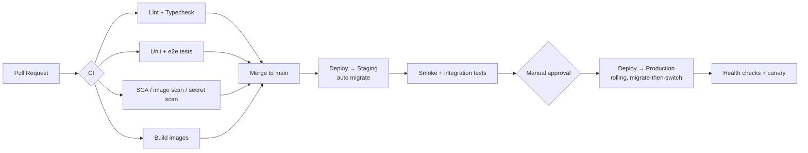

# 09 — Deployment Architecture

Containerized deployment on Ubuntu servers via Docker, promoted through CI/CD. Designed to start simple
(single multi-AZ host or small cluster) and scale horizontally without re-architecture.

---

## 1. Environments

| Env | Purpose | Data | Notes |
|-----|---------|------|-------|
| **Local/Dev** | Developer machines | Disposable; MinIO + local PG/Redis | `docker compose up`; seeded demo tenant |
| **Staging** | Pre-prod, integration tests, UAT | Sanitized/synthetic | Mirrors prod topology at smaller size |
| **Production** | Live | Encrypted, backed up | Multi-AZ, monitored, autoscaled |

Config is environment-injected (12-factor); no secrets in images. Each env has isolated credentials,
buckets, and gateway keys (test vs live).

## 2. Production Topology

```mermaid
graph TB
    subgraph Edge
        CDN[CDN / WAF]
        NGX[Nginx Reverse Proxy<br/>TLS · routing · rate limit]
    end

    subgraph App Tier (stateless, autoscaled)
        WEB1[Next.js web · N replicas]
        API1[NestJS API · N replicas]
        WRK1[Worker · per-queue replicas]
        SCH[Scheduler · singleton/leader]
    end

    subgraph Data Tier
        PGP[(PostgreSQL Primary)]
        PGR[(PG Read Replicas)]
        RED[(Redis · cache+queue+pubsub)]
        S3[(S3 Object Storage)]
    end

    subgraph Observability
        LOG[Logs]
        MET[Metrics]
        TRC[Traces]
        ALR[Alerting]
    end

    CDN --> NGX
    NGX --> WEB1
    NGX --> API1
    NGX -->|/webhooks| API1
    WEB1 --> API1
    API1 --> PGP
    API1 --> PGR
    API1 --> RED
    API1 --> S3
    API1 -->|enqueue| RED
    RED --> WRK1
    SCH --> RED
    WRK1 --> PGP
    WRK1 --> S3
    API1 -.-> LOG & MET & TRC
    WRK1 -.-> LOG & MET & TRC
    MET --> ALR
```

## 3. Containers & Images

| Image | Built from | Runtime |
|-------|-----------|---------|
| `travelos-web` | `apps/web` | Next.js standalone server (Node 20) |
| `travelos-api` | `apps/api` | NestJS HTTP server |
| `travelos-worker` | `apps/api` (worker entry) | BullMQ consumers + Chromium (PDF) |
| `travelos-scheduler` | `apps/api` (scheduler entry) | Cron jobs |
| `nginx` | `infra/nginx` | Reverse proxy / TLS |

- **Multi-stage builds** (deps → build → slim runtime); non-root user; minimal base (distroless/alpine
  where Chromium allows).
- Same `api` image runs as API, worker, or scheduler via entrypoint/env — fewer artifacts, identical code.
- Health endpoints: `/health/live`, `/health/ready` (DB/Redis/S3 checks) for orchestrator probes.

## 4. Local Development

`infra/docker/docker-compose.dev.yml` brings up: `postgres`, `redis`, `minio`, `mailhog` (email
testing), plus `api`, `worker`, `web` with hot reload. One command:

```
pnpm install
docker compose -f infra/docker/docker-compose.dev.yml up
pnpm db:migrate && pnpm db:seed   # RLS policies + system roles + demo tenant
```

## 5. CI/CD Pipeline



- **GitHub Actions** runs lint, typecheck, tests, security scans, builds, and pushes images to a registry.
- **Migrations** run as a pre-deploy step (expand/contract pattern for zero-downtime); RLS/partition SQL
  applied post-migrate.
- **Rolling deploys** with health-gated replacement; automatic rollback on failed readiness.
- Turborepo caching for fast incremental CI.

## 6. Scaling Strategy

| Tier | Scale approach |
|------|----------------|
| Web / API | Stateless → horizontal autoscale on CPU/latency; behind Nginx/LB |
| Worker | Scale per-queue by backlog depth; isolate heavy queues (PDF, AI, transcription) |
| Scheduler | Single active instance via leader election (no duplicate cron) |
| PostgreSQL | Vertical first; **read replicas** for reports/portal reads; connection pooling (PgBouncer); table partitioning for hot time-series |
| Redis | Replica/cluster; separate logical DBs for cache vs queues |
| Storage | Managed S3 (effectively unbounded) |

Read-heavy analytics and portal reads target replicas; writes go to primary. Caching (Redis) fronts
permission sets, settings, dashboards, and AI summaries.

## 7. Networking & Edge

- **Nginx** terminates TLS, routes `/` (web), `/api` (API), `/webhooks` (API), enforces basic rate limits
  and request size limits, gzip/br compression.
- **WAF/CDN** in front for static assets, DDoS mitigation, and bot filtering.
- **White-label custom domains:** map host → tenant at the edge; automated TLS (ACME) per domain.
- Data tier on a **private network** — no public DB/Redis exposure.

## 8. Observability

| Signal | Tooling (pluggable) |
|--------|---------------------|
| Logs | Structured JSON → aggregator (Loki/ELK/CloudWatch) |
| Metrics | Prometheus-compatible (API latency, error rate, queue depth, integration health, DB connections) |
| Traces | OpenTelemetry → Tempo/Jaeger; `requestId` correlation |
| Dashboards | Grafana (golden signals + business KPIs) |
| Alerts | Error spikes, queue backlog, webhook signature failures, auth anomalies, DB replica lag |
| Uptime | External synthetic checks on `/health` and key flows |

## 9. Backup & Disaster Recovery

- **PostgreSQL:** automated daily snapshots + continuous WAL archiving → **PITR**; RPO ≤ 5 min, RTO ≤ 1 h.
- **Object storage:** versioning + lifecycle policies; cross-region replication for prod.
- **Redis:** treated as ephemeral (cache) + durable queue persistence (AOF) for in-flight jobs.
- **Restore drills** scheduled (verify backups are actually restorable).
- Multi-AZ for primary services; documented failover runbook.

## 10. Configuration Matrix (key env vars)

```
# Core
NODE_ENV, APP_BASE_URL, API_BASE_URL
DATABASE_URL, DATABASE_REPLICA_URL, REDIS_URL
JWT_PRIVATE_KEY/PUBLIC_KEY, REFRESH_TOKEN_SECRET
ENCRYPTION_KMS_KEY_ID

# Storage
S3_ENDPOINT, S3_BUCKET, S3_ACCESS_KEY, S3_SECRET_KEY, S3_REGION

# AI
OPENAI_API_KEY, GEMINI_API_KEY, AI_DEFAULT_PROVIDER

# Messaging / Telephony
WHATSAPP_TOKEN, WHATSAPP_PHONE_ID, WHATSAPP_WEBHOOK_SECRET
EXOTEL_*, KNOWLARITY_*

# Email
SMTP_HOST/PORT/USER/PASS  (or provider API key)

# Payments
RAZORPAY_KEY_ID/SECRET/WEBHOOK_SECRET
CASHFREE_APP_ID/SECRET/WEBHOOK_SECRET

# Itinerary
ITINERARY_BUILDER_BASE_URL, ITINERARY_BUILDER_API_KEY
```
All validated at boot (zod); the app refuses to start with missing/invalid required config.

## 11. Deployment Runbook (essentials)
1. Merge to `main` → CI green → images pushed.
2. Staging auto-deploy + migrate + smoke tests.
3. Manual approval → production rolling deploy (expand migrations first).
4. Health/readiness gates + canary; auto-rollback on failure.
5. Post-deploy: verify dashboards, queue health, webhook deliverability.
6. Contract migrations (drop old columns) in a later release once code no longer references them.
